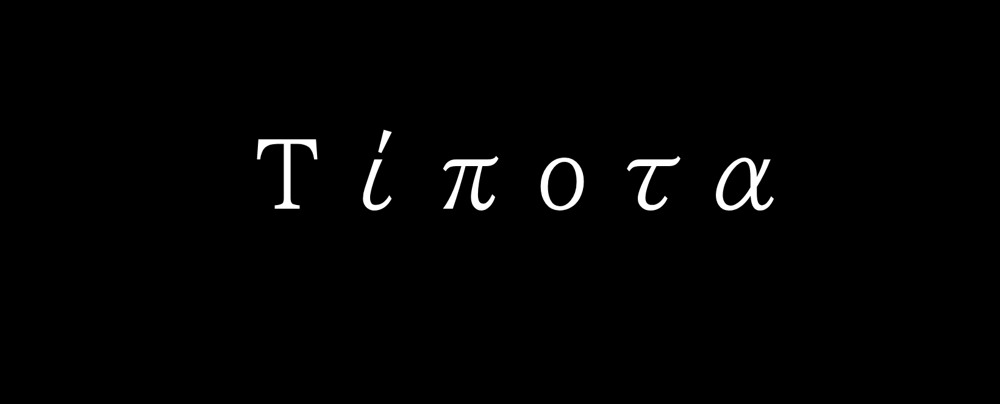

## Most used progamming languages:

* C++
* C
* ASM
* Rust

## Currently learning 

<!-- ## Applications:

* [Num-C](https://github.com/0xHorror-Dev/Num-C) (simple translator of numbers from one system to another)

* [X_WebServer](https://github.com/0xHorror-Dev/X_WebServer)(a web server written to show the possibilities of [XPlatfrom.net](https://github.com/XPlatformProject/XPlatform.net))

## Libraries:

* [XPlatform](https://github.com/XPlatformProject)
 -->

<!-- 
 -->

<!-- # Hi, I\`am `0xHorror-Dev` I\`m Software Engineer -->

<!-- 

 Visitor count 
 
--- -->

